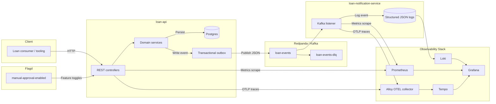

# Architecture Overview

_This document is a starting point; add diagrams and deeper explanations as the design matures._

## Components
1. **loan-api** – REST API, Postgres persistence, transactional outbox publisher.
2. **loan-notification-service** – Kafka consumer emitting JSON logs for notifications.
3. **loan-events** – Shared contracts for Kafka topics/payloads.
4. **Observability stack** – Grafana + Prometheus + Tempo + Loki + Alloy for telemetry.
5. **Feature flag service** – Flagd providing runtime toggles.

## Data Flow
1. Client invokes `loan-api` endpoint (simulate/contract/disburse/pay).
2. `loan-api` persists loan state and writes an outbox record within the same transaction.
3. Outbox dispatcher publishes the event to Kafka (`loan-events` topic).
4. `loan-notification-service` consumes the event and produces structured logs.
5. Telemetry is exported to the observability stack (metrics, traces, logs).

## Architecture Diagram
The diagram below captures primary components, data stores, and telemetry/export paths that make up the loan system.

## Operational Boundaries
- Services communicate via HTTP (clients) and Kafka (internal).
- All stateful dependencies (Postgres, Kafka, telemetry stores) run in Docker for development; production equivalents should be provisioned externally.
- Feature flags allow runtime switches without redeploying the API.

## Scalability & Resilience Notes
- `loan-api` is stateless; run multiple instances behind a load balancer. Use database uniqueness plus the outbox table’s primary key to avoid duplicate command execution.
- The outbox poller tolerates restarts; if Kafka is unavailable, events remain in `outbox_event` until the broker recovers. Monitor backlog via database counts/metrics.
- `loan-notification-service` can scale horizontally; Kafka partitions ensure consumer group rebalances.
- Development runs on Docker Compose; production should host Postgres/Kafka/telemetry on managed services or Kubernetes with equivalent configuration.
